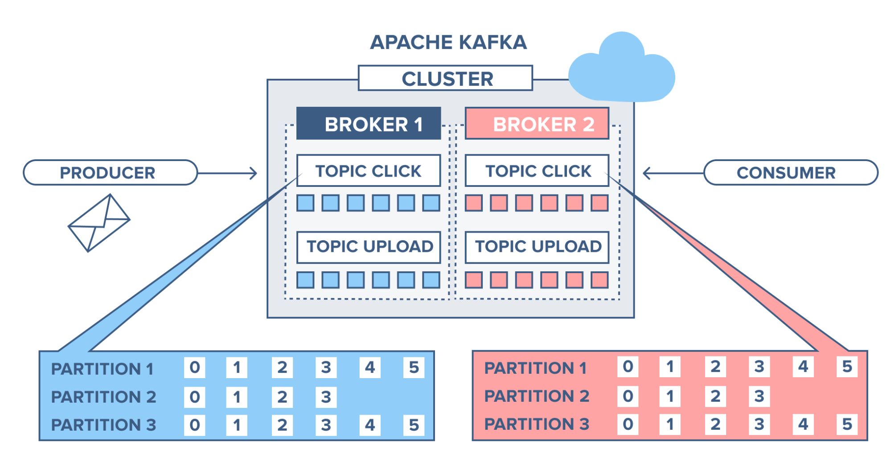
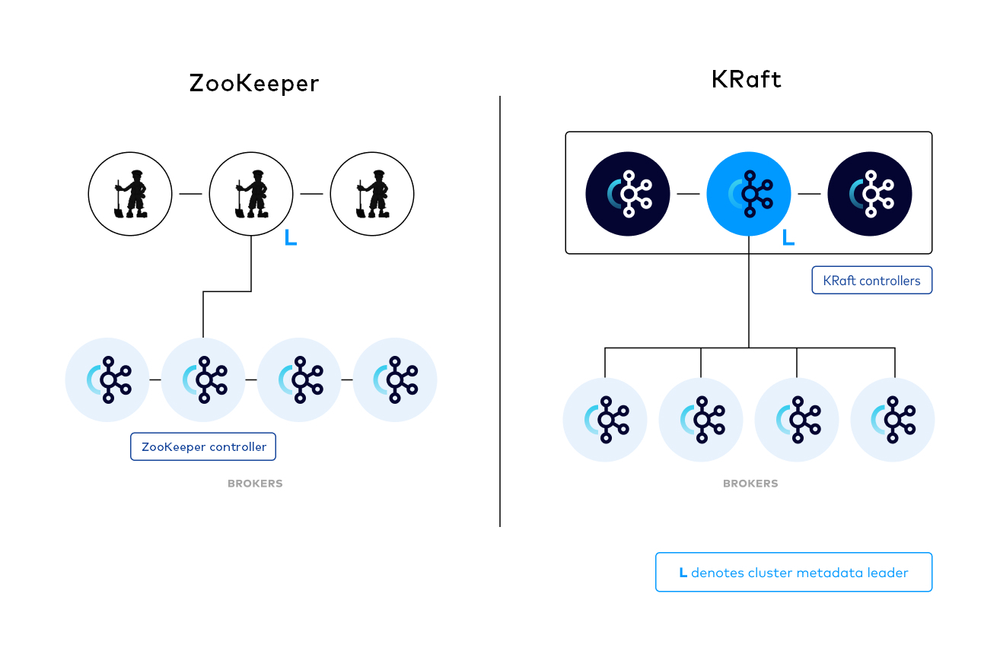

# 🗫 Kafka

Kafka allows communication between two applications that have nothing to do with each other, by communicating via the TCP protocol.

## The basics

### 👨‍💼Broker

It contains all the topics and their partitions, and it takes care of processing all requests from clients (producers and consumers).
### 📌Topic

A topic is a logical communication channel. A consumer can read data from it, and a producer will write messages to it.  
Each topic is subdivided into partitions that allow better load distribution and ensure scalability.

### 🗂️Partition

In the same topic, there are several partitions. These partitions are registered and identified by group.id, which allows distinguishing consumers and distributing processing between them.  
We can imagine a partition as an array of bytes that increases in size with each data insertion.  
A read head (the consumer) advances in this partition by following its position called offset.  
The offset keeps in memory the last block of data read by a consumer.

## 🥊Zookeeper et KRaft🥊

## 👑Zookeeper  

The Zookeeper is an external server that will be the leader of all Kafka brokers. It will elect a broker as the leader of all other brokers and notify consumers and producers.  
## 🤝KRaft  

With KRaft no need for Zookeeper. KRaft is used what is called a quorum which will allow electing a leader among all Kafka brokers. Its advantage is that there is no need to run a server with Zookeeper as KRaft is directly integrated into the Kafka server.

