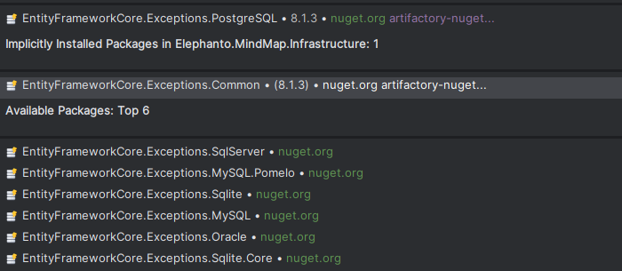

# 🛢 Entity Framework core

## The Basics

Allows building a database from our object models.
```C#
[Table("Class")]
public class ClassEntity
{
    [Key]
    [DatabaseGenerated(DatabaseGeneratedOption.Identity)]
    public Guid ClassId { get; set; }
    [Required]
    public string Name { get; set; }
    [DatabaseGenerated(DatabaseGeneratedOption.Computed)]
    public DateTimeOffset Update{ get; set; }
}
```

## 🛠️Configuration

In the builder, you will need to add your application's DbContext.
```C#
services.AddDbContext<SchoolDbContext>();
```

```C#
public class SchoolDbContext : DbContext
{
    public DbSet<Student> Students { get; set; }
    

    protected override void OnConfiguring(DbContextOptionsBuilder optionsBuilder)
    {
        optionsBuilder.UseSqlite("Data Source=MyDatabase.db");
    }

}
```

A good practice is not to follow the example below, but rather the one shown here.  
**(It makes it easier to test your code.)**

```C#
builder.AddDbContext<SchoolDbContext>(context => context.UseSqlite("Data Source=MyDatabase.db"), ServiceLifetime.Singleton);
```

```C#
public class SchoolDbContext: DbContext
{
    public SchoolDbContext(DbContextOptions<SchoolDbContext> options) : base(options)
    {
    }
    public DbSet<Student> Students { get; set; }   
}
```

## 🏭DbContextFactory

Unlike the simple configuration, this approach provides more flexibility in terms of implementation and security (it is thread‑safe if your application is multithreaded). Its main advantage is the ability to pass a `CancellationToken` provided by your application’s controller—to the various methods of your **DbContext**.

```C#
 services.AddDbContextFactory<SchoolDbContext>();
```

Injecting the DbContext is very straightforward:

```C#
private readonly IDbContextFactory<ApplicationDbContext> _contextFactory

public void Test()
{
	  using (var context = _contextFactory.CreateDbContext())
    {
        // ...
    }

}
```

The DbContext configuration remains the same as previously explained.

## 🔗Database relation

With **Entity Framework**, configuring _many-to-one_, _one-to-many_, or even _many-to-many_ relationships is quite straightforward and does not require annotations.  
It provides great flexibility, as it can automatically generate certain attributes to simplify your object models.  
(The official documentation covers this clearly.)
- [Many-to-Many](https://learn.microsoft.com/en-us/ef/core/modeling/relationships/many-to-many)
- [One-to-Many](https://learn.microsoft.com/en-us/ef/core/modeling/relationships/one-to-many)

## 🌊Drop cascade

This behavior is enabled by default and works as follows:
- If an object is deleted and it is referenced in another object through a **nullable** dependency, that related object will **not be deleted**.
- If an object is deleted and it is referenced in another object through a **non-nullable** dependency, that related object **will be deleted**.

If you want to explicitly delete a related object when another one is removed, this can be configured.

```C#
protected override void OnModelCreating(ModelBuilder modelBuilder)
{
        modelBuilder.Entity<SchoolEntity>()
            .HasMany<StudentEntity>()
            .WithOne(x => x.Shcool)
            .OnDelete(DeleteBehavior.Cascade);
        base.OnModelCreating(modelBuilder);
 }
```

## 📦 Auto Include

Auto-inclusion allows you to easily retrieve an object without having to manually build a chain of `Include` statements in your code.  
However, it’s not without drawbacks: it can increase the size and execution time of your queries due to the additional loading of related entities.

Example of configuration:

```C#
protected override void OnModelCreating(ModelBuilder modelBuilder)
{
       modelBuilder.Entity<School>()
            .Navigation(c=>c.Students)
            .AutoInclude();
        base.OnModelCreating(modelBuilder);
}
```

## 🧪Testing

There are two types of tests:
- **Mock**    
- **In-memory database**
- **Use the same database type as used in production.**

### 🎭Mock

This type of test is fairly easy to implement — you simply need to mock everything that is passed into the constructor of your repository (such as the **DbContext**).

```C#
[TestFixture]
public class SchoolRepositoryTest
{
    private ISchcoolRepository _shcoolRepositoryMock = null!;
    private ISchoolService _schoolService= null!;
    [SetUp]
    public void Setup()
    {
        _shcoolRepositoryMock = Substitute.For<ISchcoolRepository>();
        _schoolService = new SchoolService(_shcoolRepositoryMock)
    }
    
    //Create Test 
}
```

### ⚠️In Memory database⚠️

This testing approach allows you to verify your repositories in a more realistic scenario.  
In this case, Entity Framework is actually used with an **in-memory database** during tests.  
This in-memory database is automatically cleared after each test run.

The main advantage of this method is that it validates the **real behavior** of your repository.

⚠️ While using an in-memory database is a good practice for testing, if your goal is to verify the actual behavior of your production database, it’s better to use the **same database type** as in production.

Configuration:
```C#
[SetUp]
public void Setup()
{
	var option = new DbContextOptionsBuilder<SchoolDbContext>()
	    .UseInMemoryDatabase(Guid.NewGuid().ToString())
	    .Options;
	var context = new SchoolDbContext(option);
	context.Database.EnsureCreated();
	_context = context;
}
```

Test

```C#
[Test]
public async Task Test1()
{
    _context.Students.Add(new Student()
    {
        Email = "test@test.com",
        Name = "Test",
        LastName = "Test",
        Id = Guid.NewGuid().ToString(),
    });
    await _context.SaveChangesAsync();
    Assert.That(await _context.Students.CountAsync(), Is.EqualTo(1));
}
```

### Use the same database type as used in production.

To accurately simulate your application’s behavior, it is recommended to use a database similar to the one used in production.  
This is because **Entity Framework Core** includes methods that may not behave the same way across different database providers.  
For example, when using the **in-memory** provider, certain database-specific behaviors cannot be tested realistically.

You have two main options:

1. **Spin up a Docker container on the fly** during test execution to host a real instance of your production database type.
2. **Connect to a deployed test database** hosted elsewhere to run your tests against a persistent environment.


## 🔧Fluant API

To avoid placing all the configuration inside each **DbContext**, there is an interface that uses an object which will be stored in the database.

```C#
public class StudentEntityConfiguration : IEntityTypeConfiguration<StudentEntity>
{
  public void Configure(EntityTypeBuilder<StudentEntity> builder)
  {
    builder
      .HasIndex(b => b.Matricul)
      .IsUnique();
  }
}
```

```C#
protected override void OnModelCreating(ModelBuilder modelBuilder)
{
    modelBuilder.ApplyConfiguration(new StudentEntityConfiguration());
    base.OnModelCreating(modelBuilder);
}
```

or 

```C#
protected override void OnModelCreating(ModelBuilder modelBuilder)
{
    modelBuilder.ApplyConfigurationsFromAssembly(Assembly.GetExecutingAssembly());
    base.OnModelCreating(modelBuilder);
}
```

This type of configuration also allows you to isolate your domain from **Entity Framework Core** (which is ideal for **Domain-Driven Design**) and is recommended by many developers, as it tends to be more stable than relying solely on simple annotations.


## 📢Exception

[https://www.youtube.com/watch?v=QKwZlWvfh-o](https://www.youtube.com/watch?v=QKwZlWvfh-o)  
To make exception handling in C# with EF Core easier and avoid getting a single large generic exception, it is highly recommended to install the package!



## ⚠️ Improve performance ⚠️

For queries that are simple data **GET** requests, it is highly recommended to use the **AsNoTracking()** method provided by Entity Framework.  
Be careful: with **AsNoTracking()**, the **Find** method does not exist. Most people tend to use **FirstOrDefault** with a condition directly inside it — and that’s a mistake.  
Instead, it’s better to first apply a **Where** with your condition, then call **FirstOrDefault**.  
But why is that?  
Because in terms of performance, **FirstOrDefault()** is disastrous when you add a condition directly inside it.  
Ideally, you should write it like this:

```C#
dbContext.Students.AsNoTracking().Where(s => s.Id == id).FirstOrDefault()
```

## 🔍Paging

The concept of **pagination** was created solely to limit the amount of data returned to the user — not for security reasons, but for **performance** reasons.  
If I return 3 items, everything will go smoothly. But if I return 6,000, there’s a very high chance your application will stop working properly.

The idea behind pagination is to define the number of items you want to send back to the user at once.  
For example: suppose I have 6,000 records in my **Student** table. I can’t return them all at once, so I decide to split them into pages of 50 students each (meaning each request returns only 50 students).

If I do the math:  
6,000 ÷ 50 = **120 pages** — meaning it would take **120 requests** to retrieve the complete list of students in my institution.

```C#
dbContext.Students.AsNoTracking()  
      .Skip((pageNumber - 1) * pageSize)
      .Take(pageSize)
      .ToList();
```
