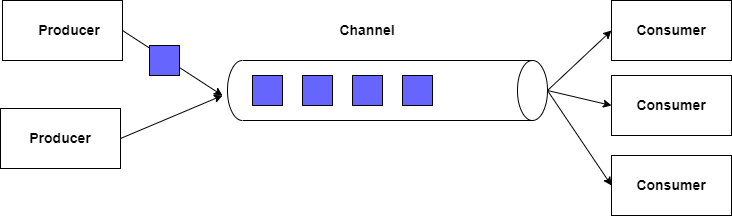

# 🚧Channel

The principle of channels in C# allows secure communication between threads, thus avoiding different errors and exceptions.





## 👨🏻‍💻 Implementation

```C#
var channel = Channel.CreateBounded<string>(3); //3 number of item inside of channel

var producer = Task.Run(async () =>
{
    for (int i = 0; i < 100; i++)
    {
        Console.WriteLine($" number of apple {i.ToString()} first thread");
        await channel.Writer.WriteAsync($" number of apple {i.ToString()}");
        await Task.Delay(100);
    }
});
var consumer = Task.Run(async () =>
{
    await foreach (var item in channel.Reader.ReadAllAsync())
    {
        Console.WriteLine($"{item} second thread");
    }
});

await Task.WhenAll(consumer, producer);
```

Result : 

```text
 number of apple 0 first thread
 number of apple 0 second thread
 number of apple 1 first thread
 number of apple 1 second thread
 number of apple 2 first thread
 number of apple 2 second thread
```

With this example, we can understand the principle according to which a channel is open between two different threads, so that our information can circulate without needing locks in our threads, nor risking exceptions. This type of implementation is useful for applications that need to execute a queue of elements. For example, if I need to convert documents to PDF, instead of making each document converted independently of the others, with this example we can use a single instance of our converter. We pass the path of each file via the channel, and this single instance of our PDF converter does its work automatically. Of course, we can add several consumers to facilitate processing in case of overload, for example.